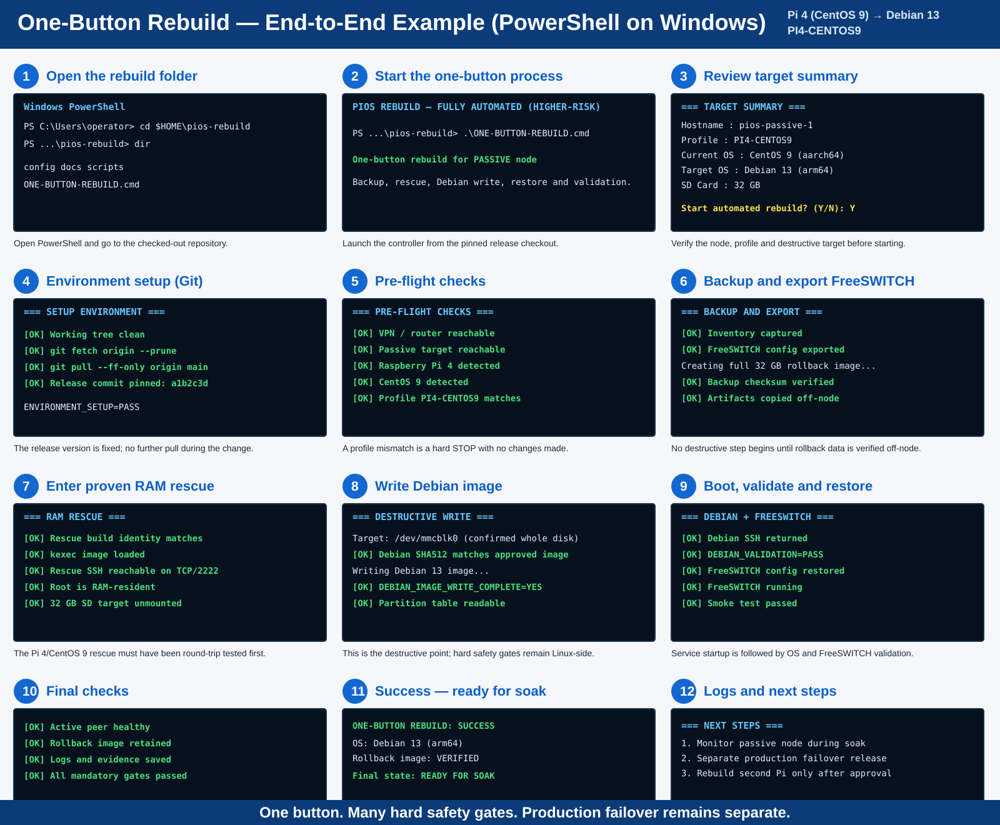

# PowerShell end-to-end visual walkthrough

This page shows what the Raspberry Pi rebuild is intended to look like from the Windows PowerShell operator's point of view.

The example shown is the `PI4-CENTOS9` profile: **Raspberry Pi 4 / CentOS 9 -> Debian 13 arm64**. The same overall flow applies to `PI3-CENTOS7`, but the hardware/OS profile and tested RAM-rescue build must match the target.

## What the visual represents

The process is deliberately presented as one operator workflow while keeping the important safety gates underneath it. The sequence is:

1. open the checked-out `pios-rebuild` repository;
2. start the one-button controller;
3. review the detected target and selected migration profile;
4. update/pin the Git release revision;
5. run VPN, hardware, OS and profile checks;
6. capture inventory, FreeSWITCH configuration and the full 32 GB rollback image;
7. enter the previously proven RAM-rescue environment and verify the SD card is unmounted;
8. write the approved Debian 13 image using the Linux rescue-side safety checks;
9. boot Debian, validate the OS, restore FreeSWITCH and run smoke tests;
10. confirm peer health, rollback availability and stored evidence;
11. finish in `READY FOR SOAK` state;
12. retain logs and schedule production failover separately after the soak period.

## Important

The screen sequence is an **illustrative operator view**, not a substitute for the release gates in `RELEASE_DAY.md`. The actual command output will contain the real hostname, IP address, Pi model, CentOS version, target device, checksums and release commit.

The one-button workflow must stop automatically on a failed mandatory gate. Production failover and approval to rebuild the second Pi remain separate decisions.